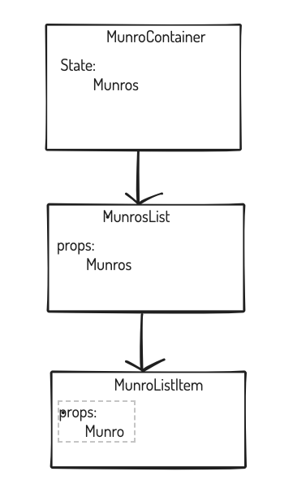
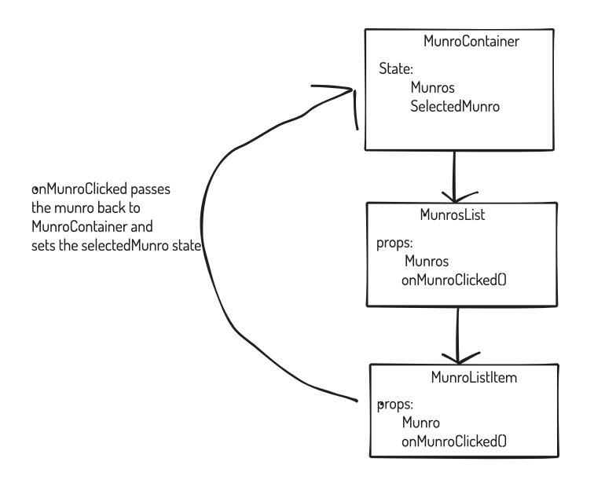
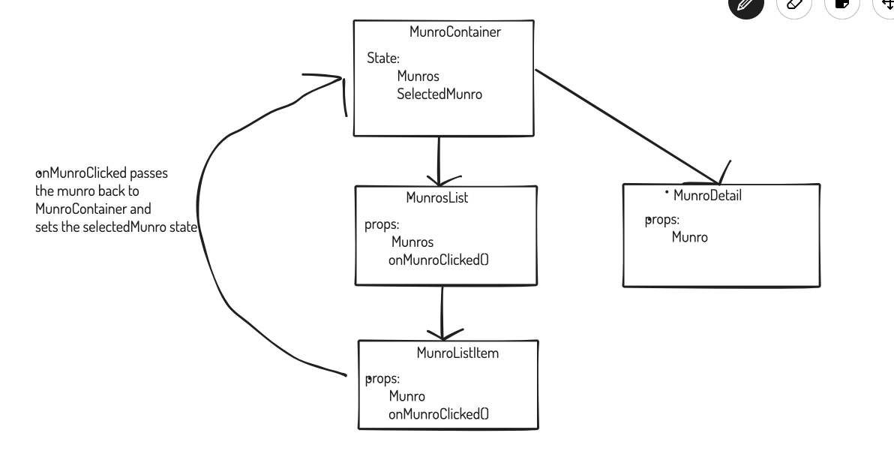

# Multiple Components and APIs

**Lesson Duration: 90mins**

### Learning Objectives
- Understand how to pass data between components

##  Intro

We've seen how to pass data down to child components and how to pass data back up by passing in functions as props. Let's put all of that together to work with an API.

### Task: 10 minutes

Read though the code and identify how the data is flowing throughout the application - for instance, where is the Munro data coming from? Where does that data then go, in terms of components and how does it get where it's going?

<details>
<summary>Answer</summary>

- On mount, `MunroContainer.js` makes a `fetch` request to the Munros API and sets the result of that to be the `munros` data field.
- The Munros data is passed down to the `MunroList` component as `props`. This is a `ul` and for each `munro` in the array of `munros` that have been passed down as props a `ListItem` component is rendered.
- The `ListItem` has `props` of `munro`.  This component is rendering the Munro's name as an `li`
</details>

At present our application could be diagrammed like this:



**What are we building?**

All we have is a list of names of Munros (a Munro is a Scottish mountain that is over 3000ft high). But if we look at the [API](https://munroapi.herokuapp.com/munros) you can see that it gives us a lot more information.

We want to be able to click on a list item and have details of that Munro render on screen. To do this we'll pass a function down to ListItem to be invoked on click of a Munro.

This plan could be diagrammed like this:




## Using the onClick in Components


First, let's set up the click event on our list element. When we click an item we want to call a `handleClick` function. Within this function, let's log out the munro that this element has access to via props.

```js
//ListItem.js

const ListItem = ({munro}) => {

  const handleClick = function() {
    console.log(`Clicked on ${munro}`)
  }

  return <li onCLick={handleClick}>{munro.name}</li>
}

export default ListItem;
```

Navigate to the browser and click on a list item, and you should see an object being logged out that has all the details of that Munro.

Now we know we have access to the Munro when we click on the list item. Next, we want to call a function that we will pass down called `onMunroClick` and pass that Munro in. (Remember we haven't written this method yet!)

```js
// ListItem.js
const ListItem = ({munro}) => {

  const handleClick = function() {
    onMunroClick(munro);
  }

  return <li onClick={handleClick}>{munro.name}</li>
}

export default ListItem;
</script>
```


## Listening for the Event

Within `MunroContainer.js` we can see that we have a data value of `selectedMunro` which is initially set as `null`. We want to set that value to be the data of the list item we've clicked on.

Let's start off by writing the function that takes in the clicked munro and sets the selectedMunro state in this component.

```js
//MunroContainer.js
const MunroContainer = () => {
    const [munros, setMunros] = useState([]);
    const [selectedMunro, setSelectedMunro] = useState(null);

   // AS BEFORE

   const onMunroClick = function(munro) {
     setSelectedMunro(munro);
   } // NEW

    return (
        <div className="main-container">
            <MunroList munros={munros} />
        </div>
    )
}


```
OK so now we have this function we can then pass it down to where it needs to be invoked. This will be our `ListItem` component. So we will need to pass down the hierarchy chain. Fist to `MunroList` then to `ListItem`

```js
//MunroContainer.js

const MunroContainer = () => {
    const [munros, setMunros] = useState([]);
    const [selectedMunro, setSelectedMunro] = useState(null);

   // AS BEFORE

   const onMunroClick = function(munro) {
     setSelectedMunro(munro);
   } // NEW

    return (
        <div className="main-container">
            <MunroList munros={munros} onMunroClick={onMunroClick}/> // MODIFIED
        </div>
    )
}
```

Then in MunroList we will destructure this in props and pass to `ListItem`.

```js
// MunroList.js

const MunroList = ({munros, onMunroClick}) => {

    const munrosItems = munros.map((munro, index) => {
      return <ListItem munro={munro} key={index} onMunroClick={onMunroClick} /> // MODIFIED
    })

  return (
    <div>
    <ul>
      {munrosItems}
    </ul>
  </div>
  )
}
```

Navigate to the browser and click on a munro in the list.  Then within your dev tools change back to component view and select the `MunroContainer` component. You should in here that `selectedMunro` has changed from `null` to our munro object.

We've now successfully managed to pass data from one component to another. From here we can use this data to render details about the selected munro.

## Rendering Munro Detail


Let's make a new component which is responsible for rendering the Munro detail. Our final product will look something like this:



```bash
touch src/components/MunroDetail.js
```

Let's start off with our component scaffolding.

```js
//MunroDetail.js
import React from 'react';

const MunroDetail = () => {

  return (
    <p>I am the munro detail component</p>
  )
}

export default MunroDetail;

```
Now we need to think about where we want this component to be rendered? We'll do it within the `MunroContainer` component as we ned to pass the selected munro down from the state.

Lets import the component and then render it next to the list.

```js
// MunroContainer.js

import React, { useState, useEffect } from 'react';
import MunroList from '../components/MunroList';
import MunroDetail from '../components/MunroDetail'; // NEW
import './MunroContainer.css';

const MunroContainer = () => {
  // AS BEFORE

    return (
        <div className="main-container">
            <MunroList munros={munros} />
            <MunroDetail /> // NEW
        </div>
    )
}

export default MunroContainer;
```

Great, now in the browser you should see `I am the munro detail component` rendering next to the list. But we don't want this, we want the details about the munro we've selected.

We want to pass details of the `selectedMunro` down to the `MunroDetail` component. How do we pass data from a parent component to a child? `props`!

```js
// MunroContainer.js

import React, { useState, useEffect } from 'react';
import MunroList from '../components/MunroList';
import MunroDetail from '../components/MunroDetail'; // NEW
import './MunroContainer.css';

const MunroContainer = () => {
  // AS BEFORE

    return (
        <div className="main-container">
            <MunroList munros={munros} />
            <MunroDetail munro={selectedMunro}/> // NEW
        </div>
    )
}

export default MunroContainer;

```

If we look in the dev tools, when a munro has been selected you should see the `MunroDetail` component's prop of `munro` is set as the `selectedMunro`.

The last thing we have to do is use this data to render details about the Munro.  

```js
//MunroDetail.js
import React from 'react';

const MunroDetail = () => {

  return (
    <div> //MODIFIED
    <h3>{munro.name}</h3>
    <p>Height: {munro.height}</p>
    <p>Region: {munro.region}</p>
    <p>Meaning: {munro.meaning}</p>
  </div>
  )
}

export default MunroDetail;
```

Navigate back to the browser and refresh the page. The list no longer renders and there's an error in the browser.

```
cannot read property name of null
```

We have an issue. The `selectedMunro` starts off as `null` and isn't populated until we click on a list item. So MunroDetail fails as the passed in munro is null so we can't try and access the properties. However, this error is preventing the app from rendering so we can't click on an item to set the selectedMunro.

To fix this we need to only render the `MunroDetail` component if there is a Munro to render. i.e `selectedMunro` is not `null`.

We can do this with a conditional logic in `MunroContainer`. We will use a ternery operator. 

```js
//MunroContainer.js

 return (
        <div className="main-container">
            <MunroList munros={munros} />
            {selectedMunro ? <MunroDetail munro={selectedMunro} /> : null} // MODIFIED
        </div>
    )
```

Sorted! Now our page renders and when we click on a munro its details render.


### Mini-Lab: 45 Minutes

Task: Rather than rendering a list of Munro names for the user to click. Change the applicatoin to have a drop down of Munros for the user to select.

* Create a new component called `MunroSelect` which takes in the Munros and a `onMunroSelected` function that will set the `selectedMunro` as props.

* Render this component from MunroContainer replacing the MunroList component. 

* in `MunroSelect` create a drop down and use the munros list passed in to create an option for each munro. The value for this will be the index of the munro in the array, **not** the full object. 

* In `MunroSelect` create an onChange function that takes in the index number, finds the munro from the array and calls the `onMunroSelected` prop.


<details>
<summary>Example Solution:</summary>

```js
// MunroSelect

import React from 'react';

const MunroSelector = ({munros, onMunroSelected}) => {

    const handleChange = function(event) {
        const chosenMunro = munros[event.target.value];
        onMunroSelected(chosenMunro);
    }
    
    const munroOptions = munros.map((munro, index) => {
      return <option value={index} key={index}>{munro.name}</option>
    })

    return (
        <select defaultValue="" onChange={handleChange}>
            <option value="" selected>Choose a Munro</option>
            {munroOptions}
        </select>
    )
}

export default MunroSelector;
```

<br />

```js
// MunroContainer
import MunroSelector from '../components/MunroSelect'; // ADDED
import './MunroContainer.css';

... AS BEFORE

 const onMunroSelected = function(munro){
        setSelectedMunro(munro);
    } // ADDED

     return (
        <div className="main-container">
            {/* <MunroList munros={munros} onMunroClick={onMunroClick} /> */} //MODIFIED
            <MunroSelector munros={munros} onMunroSelected={onMunroSelected} /> // ADDED
            {selectedMunro ? <MunroDetail selectedMunro={selectedMunro} /> : null}
            
        </div>
    )
```

</details>

## Conclusion

With functions, we now know how to access data from child passed to parent component, allowing us to continue separating the concerns of our components and working towards maintainable, reusable code.
